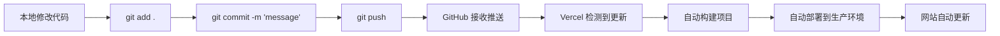

# 抛硬币应用界面优化方案 🎯

## 📋 项目概述

**当前状态：** 马年抛硬币应用已部署到 Vercel，可通过域名访问

**优化目标：** 
- 更改主题为通用的"抛硬币来决定吧！"
- 移除所有马年元素
- 提升硬币的立体感和视觉效果
- 优化抛硬币动画，使其更流畅自然
- 整体设计采用活泼可爱风格

**部署方式：** 通过 Git 提交自动触发 Vercel 部署

---

## 🎨 设计方案

### 1. 主题更新

#### 当前设计
- 标题：🐴 马年抛硬币 🐴
- 主题色：红色、黄色、橙色（马年配色）
- 硬币正面：🐴 马的emoji
- 硬币反面：福字
- 结果文案：马到成功、一马当先等

#### 优化后设计
- 标题：🪙 抛硬币来决定吧！✨
- 主题色：活泼明亮的渐变色（蓝紫粉渐变）
- 硬币正面：⭐ 星星图案
- 硬币反面：🌙 月亮图案
- 结果文案：更俏皮有趣的通用文案

---

### 2. 3D立体硬币设计

#### 技术实现方案

**使用 CSS 3D Transform 实现立体效果：**

```css
/* 硬币容器 - 启用3D空间 */
.coin-container {
  perspective: 1000px;
  transform-style: preserve-3d;
}

/* 硬币本体 - 3D立体效果 */
.coin {
  width: 200px;
  height: 200px;
  position: relative;
  transform-style: preserve-3d;
  transition: transform 0.6s;
}

/* 硬币正面 */
.coin-front {
  position: absolute;
  width: 100%;
  height: 100%;
  backface-visibility: hidden;
  border-radius: 50%;
  background: linear-gradient(135deg, #FFD700 0%, #FFA500 100%);
  box-shadow: 
    inset -10px -10px 20px rgba(0,0,0,0.2),
    inset 10px 10px 20px rgba(255,255,255,0.3),
    0 20px 40px rgba(0,0,0,0.3);
}

/* 硬币反面 */
.coin-back {
  position: absolute;
  width: 100%;
  height: 100%;
  backface-visibility: hidden;
  transform: rotateY(180deg);
  border-radius: 50%;
  background: linear-gradient(135deg, #C0C0C0 0%, #808080 100%);
  box-shadow: 
    inset -10px -10px 20px rgba(0,0,0,0.2),
    inset 10px 10px 20px rgba(255,255,255,0.3),
    0 20px 40px rgba(0,0,0,0.3);
}

/* 硬币边缘厚度效果 */
.coin::before {
  content: '';
  position: absolute;
  width: 100%;
  height: 100%;
  border-radius: 50%;
  background: linear-gradient(90deg, 
    #B8860B 0%, 
    #FFD700 25%, 
    #B8860B 50%, 
    #FFD700 75%, 
    #B8860B 100%
  );
  transform: translateZ(-10px);
}
```

**视觉特点：**
- ✅ 硬币有明显的厚度感（10px）
- ✅ 内阴影和外阴影营造立体感
- ✅ 边缘有金属质感的条纹
- ✅ 正反面颜色对比明显（金色 vs 银色）

---

### 3. 抛硬币动画优化

#### 当前动画问题
- 翻转动作过于机械
- 缺少物理真实感
- 没有抛起和落下的过程
- 动画曲线不够自然

#### 优化后的动画方案

**分阶段动画设计：**

```css
@keyframes coinFlip {
  /* 阶段1: 快速抛起 (0-20%) */
  0% {
    transform: translateY(0) rotateY(0deg) rotateX(0deg);
  }
  20% {
    transform: translateY(-150px) rotateY(360deg) rotateX(180deg) scale(1.1);
  }
  
  /* 阶段2: 空中翻转 (20-60%) */
  40% {
    transform: translateY(-180px) rotateY(720deg) rotateX(360deg) scale(1.15);
  }
  60% {
    transform: translateY(-150px) rotateY(1080deg) rotateX(540deg) scale(1.1);
  }
  
  /* 阶段3: 下落 (60-85%) */
  85% {
    transform: translateY(0) rotateY(1440deg) rotateX(720deg) scale(1);
  }
  
  /* 阶段4: 弹跳 (85-100%) */
  92% {
    transform: translateY(-20px) rotateY(1440deg) rotateX(720deg) scale(1.05);
  }
  100% {
    transform: translateY(0) rotateY(1440deg) rotateX(720deg) scale(1);
  }
}

/* 使用缓动函数增加真实感 */
.coin.flipping {
  animation: coinFlip 2.5s cubic-bezier(0.25, 0.46, 0.45, 0.94);
}
```

**动画特点：**
- ✅ 抛起阶段：快速向上，同时开始旋转
- ✅ 空中阶段：持续翻转，略微放大
- ✅ 下落阶段：加速下落，符合重力效果
- ✅ 落地阶段：轻微弹跳，增加真实感
- ✅ 使用 cubic-bezier 缓动函数模拟物理运动

---

### 4. 配色方案

#### 活泼可爱风格配色

**主背景渐变：**
```css
background: linear-gradient(135deg, 
  #667eea 0%,   /* 柔和的紫色 */
  #764ba2 25%,  /* 深紫色 */
  #f093fb 50%,  /* 粉紫色 */
  #4facfe 75%,  /* 天蓝色 */
  #00f2fe 100%  /* 青色 */
);
```

**硬币配色：**
- 正面（星星）：金黄色渐变 `#FFD700 → #FFA500`
- 反面（月亮）：银白色渐变 `#E8E8E8 → #B0B0B0`
- 边缘：金属质感 `#B8860B ↔ #FFD700`

**按钮配色：**
- 主按钮：`#FF6B9D → #C06C84`（粉红渐变）
- 次按钮：`#4FACFE → #00F2FE`（蓝色渐变）
- 悬停效果：亮度提升 + 轻微放大

**文字配色：**
- 主标题：`#FFFFFF`（白色，带阴影）
- 结果文字：根据结果不同使用不同颜色
  - 正面：`#FFD700`（金色）
  - 反面：`#E8E8E8`（银色）
  - 立住：`#FF6B9D`（粉色）
  - 消失：`#A0A0A0`（灰色）

---

### 5. 文案优化

#### 页面标题
```
当前：🐴 马年抛硬币 🐴
优化：🪙 抛硬币来决定吧！✨
```

#### 硬币图案
```
当前：
- 正面：🐴（马）
- 反面：福

优化：
- 正面：⭐（星星）+ "YES"
- 反面：🌙（月亮）+ "NO"
```

#### 结果文案

**正面结果：**
```
当前：🎉 正面 - 马到成功！
优化：⭐ 正面 - 就这么决定啦！
```

**反面结果：**
```
当前：🎊 反面 - 福星高照！
优化：🌙 反面 - 换个方向试试？
```

**立住结果：**
```
当前：✨ 硬币立住了！一马当先！
优化：🎪 哇！硬币立住了！你太幸运了！
```

**消失结果：**
```
当前：💫 硬币消失了...
优化：🕳️ 哎呀！硬币滚走了...
```

#### 按钮文案
```
当前：
- 主按钮：抛硬币
- 次按钮：再来一次

优化：
- 主按钮：让命运决定 🎲
- 次按钮：再试一次 🔄
- 抛硬币中：硬币飞起来啦~ ✨
```

#### 提示文案
```
当前：
💡 小提示：
正面/反面各 47% 概率
硬币立住 5% 概率
硬币消失 1% 概率

优化：
🎯 概率说明：
⭐ 正面 47% - 就这么办！
🌙 反面 47% - 换个想法
🎪 立住 5% - 超级幸运
🕳️ 消失 1% - 命运的玩笑
```

---

### 6. UI组件优化

#### 按钮设计
```css
/* 主按钮 - 活泼风格 */
.primary-button {
  background: linear-gradient(135deg, #FF6B9D 0%, #C06C84 100%);
  border-radius: 50px;
  padding: 16px 40px;
  font-size: 20px;
  font-weight: bold;
  color: white;
  box-shadow: 0 8px 20px rgba(255, 107, 157, 0.4);
  transition: all 0.3s ease;
}

.primary-button:hover {
  transform: translateY(-3px) scale(1.05);
  box-shadow: 0 12px 30px rgba(255, 107, 157, 0.6);
}

.primary-button:active {
  transform: translateY(-1px) scale(1.02);
}
```

#### 结果显示卡片
```css
.result-card {
  background: rgba(255, 255, 255, 0.95);
  backdrop-filter: blur(10px);
  border-radius: 20px;
  padding: 24px;
  box-shadow: 0 10px 40px rgba(0, 0, 0, 0.1);
  animation: slideUp 0.5s ease-out;
}

@keyframes slideUp {
  from {
    opacity: 0;
    transform: translateY(30px);
  }
  to {
    opacity: 1;
    transform: translateY(0);
  }
}
```

---

## 🔄 自动部署流程

### Git + Vercel 自动部署

**工作流程：**



**具体步骤：**

1. **本地修改代码**
   - 编辑 [`app/page.tsx`](app/page.tsx)
   - 编辑 [`app/globals.css`](app/globals.css)

2. **提交到 Git**
   ```bash
   git add .
   git commit -m "优化界面：更新主题和3D硬币效果"
   git push
   ```

3. **Vercel 自动部署**
   - Vercel 监听 GitHub 仓库
   - 检测到新提交自动触发构建
   - 构建成功后自动部署
   - 通常 2-3 分钟完成

4. **访问网站查看效果**
   - 访问：`https://coin.linggxz.online`
   - 刷新页面查看最新效果

**注意事项：**
- ✅ 确保 Vercel 已连接到 GitHub 仓库
- ✅ 确保 Vercel 项目设置为自动部署
- ✅ 每次 push 都会触发部署
- ✅ 可以在 Vercel 控制台查看部署状态

---

## 📝 实施步骤

### 步骤1：更新页面主题和文案
- 修改 [`app/page.tsx`](app/page.tsx) 中的标题
- 移除所有马相关的 emoji 和文案
- 更新硬币正反面的图案
- 优化结果提示文案

### 步骤2：实现3D立体硬币
- 在 [`app/page.tsx`](app/page.tsx) 中重构硬币组件结构
- 添加硬币正面、反面、边缘的 HTML 结构
- 编写 3D CSS 样式
- 添加光影效果

### 步骤3：优化抛硬币动画
- 重写 `@keyframes flip` 动画
- 添加抛起、翻转、下落、弹跳阶段
- 使用物理缓动函数
- 调整动画时长和时机

### 步骤4：更新配色方案
- 修改背景渐变色
- 更新硬币颜色
- 优化按钮配色
- 调整文字颜色

### 步骤5：优化UI组件
- 重新设计按钮样式
- 添加悬停和点击效果
- 优化结果显示卡片
- 添加过渡动画

### 步骤6：测试和调试
- 测试抛硬币功能
- 检查动画流畅度
- 验证各种结果显示
- 测试响应式布局

### 步骤7：提交和部署
- 提交代码到 Git
- 推送到 GitHub
- 等待 Vercel 自动部署
- 访问网站验证效果

---

## 🎯 预期效果

### 视觉效果
- ✅ 硬币具有明显的3D立体感
- ✅ 抛硬币动画流畅自然
- ✅ 整体设计活泼可爱
- ✅ 配色明亮协调

### 用户体验
- ✅ 动画更有趣味性
- ✅ 文案更俏皮可爱
- ✅ 交互反馈更明确
- ✅ 视觉吸引力更强

### 技术实现
- ✅ 纯 CSS 实现，无需额外依赖
- ✅ 性能优秀，动画流畅
- ✅ 代码结构清晰
- ✅ 易于维护和扩展

---

## 📊 对比总结

| 方面 | 当前版本 | 优化后版本 |
|------|---------|-----------|
| **主题** | 马年抛硬币 | 抛硬币来决定吧！ |
| **硬币效果** | 平面圆形 | 3D立体硬币 |
| **动画** | 简单翻转 | 抛起-翻转-落下-弹跳 |
| **配色** | 红黄橙（马年色） | 蓝紫粉渐变（活泼色） |
| **文案** | 马相关成语 | 俏皮通用文案 |
| **图案** | 🐴 + 福 | ⭐ + 🌙 |
| **风格** | 节日主题 | 通用可爱风 |

---

## ✅ 验收标准

完成后应满足以下标准：

1. **主题更新**
   - [ ] 标题改为"抛硬币来决定吧！"
   - [ ] 所有马元素已移除
   - [ ] 文案更新为通用内容

2. **3D效果**
   - [ ] 硬币有明显的厚度感
   - [ ] 光影效果自然
   - [ ] 正反面区分明显

3. **动画效果**
   - [ ] 抛硬币动画流畅
   - [ ] 有抛起和落下过程
   - [ ] 落地有弹跳效果
   - [ ] 动画时长合适（2-2.5秒）

4. **视觉设计**
   - [ ] 配色活泼明亮
   - [ ] 整体风格可爱
   - [ ] 按钮样式美观
   - [ ] 响应式布局正常

5. **自动部署**
   - [ ] 代码已提交到 Git
   - [ ] Vercel 自动部署成功
   - [ ] 网站可正常访问
   - [ ] 所有功能正常工作

---

## 🚀 后续优化建议

完成基础优化后，可以考虑：

1. **添加音效**
   - 抛硬币时的"叮"声
   - 落地时的"咚"声
   - 特殊结果的音效

2. **添加粒子效果**
   - 抛硬币时的星星粒子
   - 结果显示时的烟花效果

3. **添加历史记录**
   - 记录抛硬币历史
   - 显示统计数据

4. **添加自定义选项**
   - 自定义硬币正反面文字
   - 自定义概率
   - 自定义主题色

5. **社交分享功能**
   - 分享结果到社交媒体
   - 生成结果图片

---

**准备好开始优化了吗？** 🎨✨
